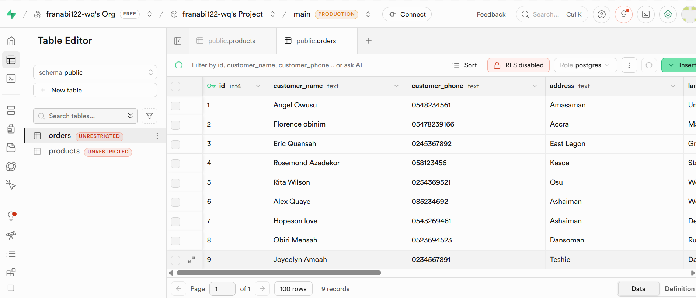
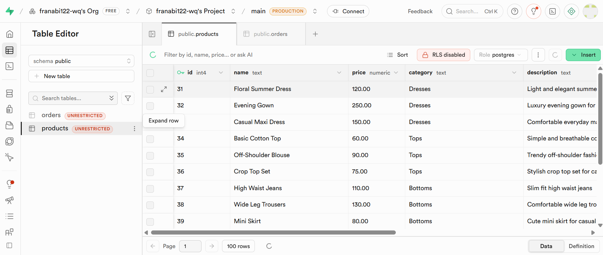

Abigail Clothing Brand (ACB)
Project Overview
Abigail Clothing Brand (ACB), also referred to as Abigail Apparel, is an Android-based e-commerce mobile application developed to provide users with a simple and convenient platform for shopping fashion products online.
The application allows users to browse clothing products, explore product categories, add items to a shopping cart, and place orders through a mobile interface.
The project was developed using Java and XML in Android Studio, with backend integration through Supabase/PostgreSQL, REST APIs, JSON, and mobile money payment services.
Key Features
User Registration and Login
Product Listings
Product Categories
Product Details
Shopping Cart System
Order Placement
Mobile Money Checkout
Order History
API Integration
Responsive User Interface
Supabase Backend Integration
Technologies Used / Technical Stack
Java
XML
Android Studio
REST APIs
Supabase / PostgreSQL
JSON
Git
GitHub
Project Structure
Abigail Apparel
├── app
├── models
├── adapters
├── activities
├── fragments
├── network
├── database
└── resources
Installation
Clone or download the project.
Open the project in Android Studio.
Sync the Gradle files.
Configure the required API endpoints and database connection.
Run the application on an Android device or emulator.
System Requirements
Android Studio
Android SDK
Java Development Kit (JDK)
Internet connection for API communication
--Application Screenshots

Splash Screen:

Admin Page:

Home Page:

Product Details:

Product Categories:

Product Save Page:

Login Page:

Signup Page:

Cart Page:

Check-out Page:

Order Success Screen:

Order History Page:

---

Database Schema
The Abigail Apparel application uses a Supabase/PostgreSQL database to store and manage application data such as users, products, categories, carts, and orders.
The database schema was designed to support efficient data storage and communication between the Android application and backend services.

Order table schema:

Products table schema:

----

Payment Integration
The application includes a mobile money checkout workflow for processing payments during order checkout.
Payment integration was developed and tested using an API-based payment workflow connected through the application's backend services.
The project also includes payment status tracking to help verify the result of a payment transaction before completing an order.

---
Challenges Faced
During development, I encountered and worked through several challenges, including:
Package refactoring
API integration issues
Database configuration
UI debugging
Payment integration and testing
Learning new Android development concepts
---

System Maintenance
The Abigail Apparel project was maintained throughout development by fixing bugs, updating features, improving the user interface, resolving database and API issues, and ensuring that the application functioned properly during testing and development.

---
Future Improvements
Possible future improvements include:
Push notifications
Production-ready payment integration
Admin dashboard
Enhanced security features
Product search and filtering
Improved order management
Additional e-commerce functionality

---

Conclusion
The Abigail Apparel application demonstrates practical experience in Android application development, API integration, database management, mobile payment workflows, and software engineering.
The project provided hands-on experience in developing, integrating, debugging, testing, and maintaining a mobile e-commerce application.

---

Developer
Developed by Abigail Quansah
Copyright © 2026 Abigail Quansah

